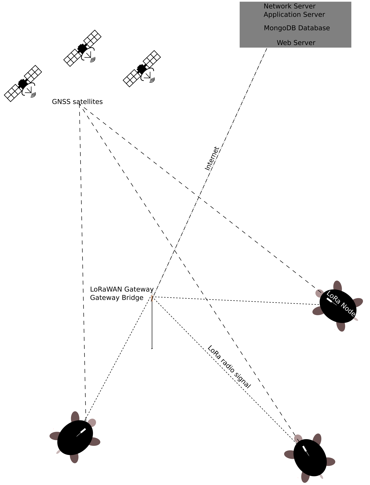

# TerrapinTracker
The goal of this project (https://conservationx.com/project/id/491/terrapintracker) is to develop a lightweight, low power consumption tracker that can be used for relatively light (>200 g) animals. The primary components of the tracker are a GNSS receiver and a LoRa radio transceiver. The initial species we are targeting for tracking is the diamondback terrapin (DBT, Malaclemys terrapin) but the tracker can be adapted to other taxa.

The information in this repository is currently focused on the tracking the DBT but the longer term goal is to develop a workflow that will make it easier to design and create purpose-built GNSS/radio trackers for a wide range or animals.

This repository includes information about the hardware and software components required for a functioning monitoring system. We have a working prototype but are still in the experimental stage with many design options being tested. Please reach out if you have an interest in contributing, commenting or simply want to follow along.

Below is a figure illustrating the following core components of the tracker system:
## GNSS receiver on the LoRa node:
Provides periodic turtle location information

## LoRaWAN node (on the turtle) and stationary gateway radio(s): 
The node sends location and other data from a turtle to the gateway and the gateway send the data to the Internet. The gateway antenna should be mounted as high as is practical.

## Server(s) for managing LoRaWAN communication:
Decode data sent from turtles then process and forward data to a database.

## Database (we are using MongoDB) for storing data and making it accessible:
Add data to a database that can be queried so data can be downloaded for analysis

